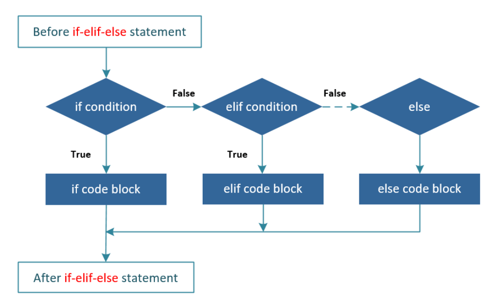
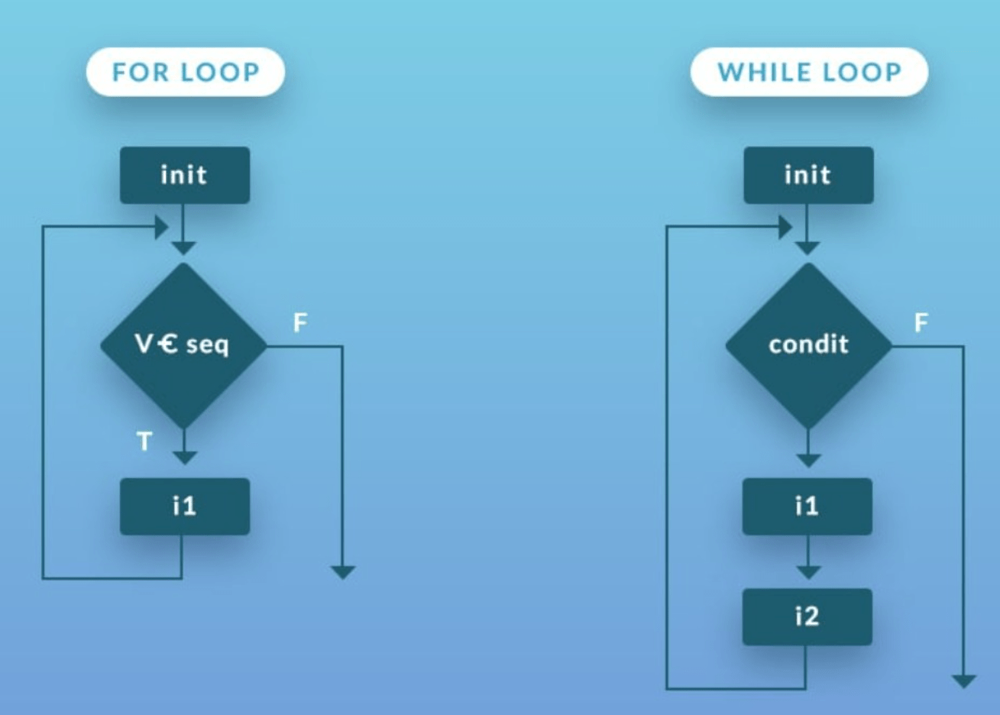
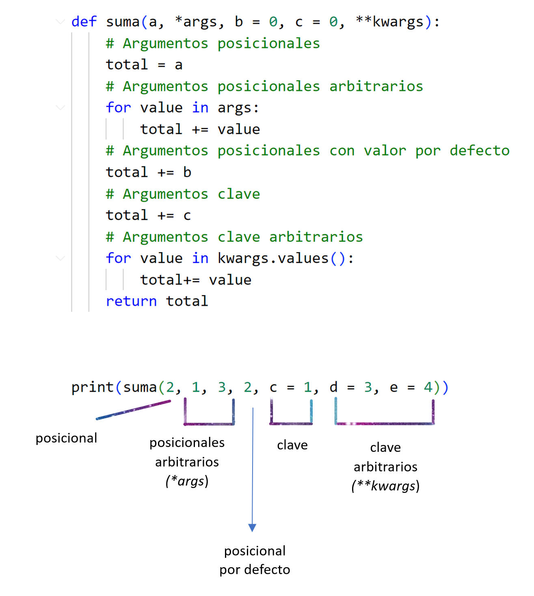
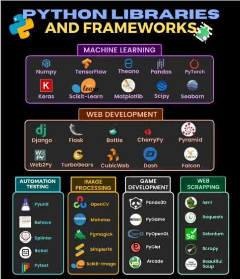

## 1.	¿Qué es un condicional?
### Sentencias condicionales If - Else - Elif
La condición es una expresión booleana, es decir, una expresión que evalúa a (Python) **True** o **False**, ya que los valores booleanos solo pueden ser verdadero o falso.

Las  sentencias condicionales de Python son **If**, **Else** y **Elif**. Permiten ejecutar el código si se cumplen las condiciones. Este sistema de toma de decisiones es esencial para los programadores, especialmente en el campo de la Data Science:


| Declaración   | Utilización                                             |
|-------------|------------------------------------------------------|
| **if**      | permite crear una rama opcional, una condición única |
| **if - else**   | permite crear dos ramas con una única condición      |
| **elif - else** | permite crear más ramas con dos o más condiciones    |

El flujo de este código está representado en el siguiente diagrama:



<br>
*Ejemplos:*<br><br>

**if  ("Si")**

    if edad < 18:
    	print("puedes suscribirte")

<br>

**else  ("Si no")**

    if edad < 18:
    	print("debes tener 18 años mínimo")
    else:
    	print("suscríbete")

<br>

**elif  ("Si no, si")**

    if edad < 18:
    	print("debes tener 18 años mínimo")
    elif edad == 18:
    	print("ya tienes mayoría de edad; ¡suscríbete!")
    else:
    	print("suscríbete")
<br>

### Operadores ternarios

<br>
Otra forma de escribir el código condicional es mediante los **operadores ternarios**, código de una línea que engloba los condicionales:

*Ejemplo:*

    lluvia = True
    tiempo = "está lloviendo" if lluvia else "No hay lluvia"

<br>
 
 <span style="color:green"><strong>BUENAS PRÁCTICAS PARA LOS OPERADORES TERNARIOS:</strong></span>
 <br>
 
  
  
  
  <span style="color:green">
  En líneas sencillas de código, los operadores ternarios puede ser la mejor opción. No obstante, debemos ser siempre cuidadosos en cuanto a la complejidad de nuestro código, y en este caso debemos asegurarnos de que la expresión de estas condiciones sea fácil de entender, ya que no es infrecuente ver código de estos condicionales con una lectura poco clara.  En este caso, es mejor utilizar las condicionales estándares **if-else** (bloques de código con indentación), ya que será menos confuso.
  </span>
  
<br>
<br>

### Condicionales compuestos

Los *operadores condicionales lógicos o booleanos* de Python "**and**", "**or**" y "**not** permiten establecer múltiples condiciones. Se utilizan para probar condiciones y decidir qué ruta de ejecución seguirán los programas.
<br>
<br>
<p style="color:blue"> <strong><big>and:</strong></big> </p>
sirve para realizar condiciones combinadas, <strong>ambas condiciones</strong> deben ser correctas. En el siguiente ejemplo, tanto usuario como contraseña debe cumplirse:

*Ejemplo:*

    if username == "Maria" and password == "Gen147":
    	print("acceso permitido")
    else:
    	print("no tienes permisos")
    	

#### **Operadores de comparación**:


| operador 	|       descripción      	|
|:-------:	|:----------------------:	|
|   ==    	| Igual a                	|
|   !=    	| distinto de            	|
|   <>    	| distinto de (OBSOLETO) 	|
|    >    	| mayor que              	|
|   >=    	| mayor o igual que      	|
|    <    	| menor que              	|
|   <=    	| menor o igual que      	|

<br>
<br>
<p style="color:blue"> <strong><big>or:</strong></big> </p>
El programa ejecuta si al menos <strong>una de las dos condiciones</strong> es verdadera. En el siguiente caso, se podría entrar a la aplicación tanto si eres administrador ("admin") como si eres fabricante; de otro modo se negará el acceso:
<br>

*Ejemplo:*

if username == "admin" or username == "fabricante":
&ensp;print("acceso permitido")
else:
&ensp;print("no tienes permisos")
<br>
<br>
<br>
<p style="color:blue"> <strong><big>not:</strong></big> </p>
Exige que <strong>no se dé la condición</strong>. Digamos que <strong>niega la condicion</strong> escrita. Esencialmente lo que hace es que invierte el valor booleano de la expresión.

*Ejemplo:*

    stock = 30
    if not stock < 10:
        print("disponibilidad inmediata")

En cuanto a los **operadores booleanos**, debemos tener en cuenta las siguientes reglas básicas:


|       	|     	|       	|          	|       	|
|-------	|-----	|-------	|----------	|-------	|
|  **True** 	| and 	| **True**  	| devuelve 	| **True** 	|
|  **True** 	| and 	| **False** 	| devuelve 	| **False** 	|
| **False** 	| and 	| **True**  	| devuelve 	| **False** 	|
| **False** 	| and 	| **False** 	| devuelve 	| **False** 	|
|  **True** 	| or  	| **True**  	| devuelve 	| **True**  	|
|  **True** 	| or  	| **False** 	| devuelve 	| **True**  	|
| **False** 	| or  	| **True**  	| devuelve 	| **True**  	|
| **False** 	| or  	| **False** 	| devuelve 	| **False** 	|


************

<br>
<br>
<br>

## 2. ¿Cuáles son los diferentes tipos de bucles en Python? ¿Por qué son útiles?

A menudo se dan situaciones en las que se necesita utilizar un fragmento de código una y otra vez, y esto se puede hacer con los **bucles**, que evitan la necesidad de escribir la misma línea de código varias veces.

Así pues, los bucles de Python son útiles porque permiten repetir la ejecución de un bloque de código, **lo que ahorra tiempo** y **reduce errores**.

Existen **dos tipos** de bucles en Python:

| for                                              | while                                        |
|--------------------------------------------------|----------------------------------------------|
| nº de interaciones **definido** de antemano          | nº de interaciones **no definido**               |
| el **iterable** que es el que define **número** de interaciones | la condición es evaluada en **cada interacción** |


<br>





<br>


### 1. Bucle <big>**for - in**</big> 

El bucle <big>**for - in**</big> utiliza un **iterador** para recorrer un objeto iterable y ejecutar un bloque de código. En cada paso de la iteración se tiene en cuenta a un **único elemento del objeto iterable**, sobre el cuál se pueden aplicar una serie de **operaciones**. Este bucle utiliza la palabra clave **<big>in**</big> para separar la variable de índice del bucle (**iterador**) de lo que se está recorriendo (**iterable**). Definiremos *iterador* e *iterable*: 
-   **Iterador** es un objeto que se usa para **iterar sobre un objeto iterable**.
-   **Iterable** se refiere a una **secuencia** sobre la que se puede iterar. En Python se puede iterar prácticamente todo, desde **una cadena de caracteres**, **una lista**, **una tupla**, **un diccionario**, **un conjunto**...incluso **un fichero**. 

En el siguiente ejemplo de una **cadena de caracteres** como iterable, veremos cómo el **iterador**, es decir la variable que controla la iteración, en este caso ***letra***, va tomando los valores de cada letra:

*Ejemplo:*

    for letra in "Minombre">
    	print(letra)
    

    #Devuelve:
    M
    i
    n
    o
    m
    b
    r
    e


<br>
En este otro caso, iteramos <strong>una lista</strong>:

    cenaviernes = ['David', 'Nora', 'Ander', 'Susi']
    for nombre in cenaviernes:
    	print(f'No te olvides del viernes {nombre}!')
    	
	
    """
    Devuelve:
    No te olvides del viernes David!
    No te olvides del viernes Nora!
    No te olvides del viernes Ander!
    No te olvides del viernes Susi! """"


<br>
    	
También podemos utilizar rangos, con el método <strong>range</strong>:

    morning_hours = range(3,10)
    for h in morning_hours:
    	print(h)

    """Devuelve:
    3
    4
    5
    6
    7
    8
    9    """"
    	
    	
    	
En el rango(3,10), el 10 es el valor de parada, imprimiría solo hasta el número anterior.


<br>

### 2. Bucle **<big>while</big>**

El bucle **<big>while</big>**  se usa cuando **no se conoce de antemano el número de repeticiones**. La ejecución de un bloque de código se repetirá (seguirá iterando una y otra vez) hasta el final de la lista **mientras se cumpla una condición** y no parará hasta que se lo indiquemos en un punto determinado, es decir mientras la condición sea ***True*** o verdadera, y lo repite hasta que sea ***False*** o falsa. Es aquí donde entra el concepto de valor **centinela** (llamado también **bandera**), que es el que le indica cuándo parar. 

Hay que tener cuidado con utilizar este tipo de bucle, porque se puede producir lo que se conoce como **bucle infinito**; se nos puede olvidar poner este valor **centinela** que rompa el ciclo, y hará que el programa falle.


El código en el siguiente ejemplo imprimirá la tabla de multiplicar del número 6. Vemos que solo lo hará mientras el número sea menor o igual a 10 (**valor centinela**), . Se detendrá cuando llegue al número 10 inclusive:

*Ejemplo:*
    
    
    num = 0
    print('Esta es la tabla del 6')
    while num <= 10:
        print(f'{num * 6}')
        num += 1
    print('Fin')
        
        
        
    """Imprime:
    Esta es la tabla del 6
    0
    6
    12
    18
    24
    30
    36
    42
    48
    54
    60
    Fin    """


<br>

### 3. Sentencias **<big>break</big>** y **<big>continue</big>**  para bucles de ***<big>for</big>*** y ***<big>while</big>*** <br><br>

- La sentencia **<big>break</big>** permite **salir completamente de un bucle** cuando se cumple una condición específica, deteniendo así su ejecución. 

*Ejemplo:*


    regalo = 'My ruby is yours'
    for letra in regalo:
    	if letra == 'b':
    		print("Se encontró la b")
            break
		print(letra)
    
    """Imprime:
    M
    y
    
    r
    u
    Se encontró la b      """"
<br>

- La sentencia **<big>continue</big>** da la opción de **omitir la parte de un bucle** en la que se activa una condición externa, pero **continúa para completar el resto del bucle**. Es decir, la iteración actual del bucle se interrumpirá, pero el programa volverá a la parte superior del bucle.

*Ejemplo:*


    for num in range(20, 30):
    	if num % 2 == 0:
    		continue
    	print(num)
    	
    	
    """Imprime:
    21
    23
    25
    27
    29         """	
    	
    

>Como vemos, tanto la instrucción **<big>break</big>** como **<big>continue</big>** se pueden colocar dentro del bloque de código abajo de la instrucción del bucle, generalmente después de una instrucción **if** condicional.
************
 


<br>
<br>
<br>


## 3.	¿Qué es una lista por comprensión en Python?

En esencia, es una forma rápida y dinámica de **crear listas a partir de otra en una sola línea de código**.  Tiene la siguiente **sintaxis**:


|                    |         |      |        |          |             |
|--------------------|---------|------|--------|----------|-------------|
| Expresión del item | **for** | item | **in** | iterable | (**if** condición) |

<br>
<strong>"Expresión del item"</strong> se refiere al comportamiento o acción que queramos conseguir del item o variable, que se debe mapear a la variable que separa el <big><strong>for</strong></big> del <big><strong>in</strong></big>. Utiliza el bucle <big><strong>for</strong></big> dentro de dos corchetes <big><strong>[ ]</strong></big>, y el resultado siempre es <strong>una lista</strong>. Opcionalmente le pueden seguir otros bucles <big><strong>for</strong></big> y/o <strong>una condición</strong>.

Hay múltiples **casos** en los que las listas de compresión **puede ser útil**. Un ejemplo sería si estamos construyendo **una página web o una aplicación móvil** y quieres seleccionar una fila sí y otra no, porque quizá quieres sombrear la tabla para que su contenido sea más legible: para ello, bastaría con seleccionar los números pares.


<br>


Por otra parte, existe un gran número de aplicaciones, algunas serían:


<br>


- Poner las palabras de una lista con la **primera letra en mayúsculas**:

*Ejemplo:*

    coches = ['mustang', 'ferrari', 'porsche', 'maserati']
    nom_coche = [coche.title() for coche in coches]
    print(nom_coche)


    """Imprime:
    ['Mustang', 'Ferrari', 'Porsche', 'Maserati']         """
    


<br>


- **Calcular los cuadrados** del 0 al 9 de los números pares:

*Ejemplo:*

    cuadrados_pares = [num**2 for num in range(10) if num % 2 == 0]
    print(cuadrados_pares)
    
    
    """imprime:
    [0, 4, 16, 36, 64]     """ 


<br>


- **Número, cuadrado y exponente** :


*Ejemplo*:


    num_doble_cuadrado = [(num, num * 2, num ** 2) for num in range(6)]
    print(num_doble_cuadrado)
    
    
       """Imprime: 
    [(0, 0, 0), (1, 2, 1), (2, 4, 4), (3, 6, 9), (4, 8, 16), (5, 10, 25)] , 
    (calculará para los números de 0 a 5 inclusives)  """

 


<br>


- Imprime los **números pares**, y los que **no lo son pone un 0**:

*Ejemplo*:

    numeros = [1, 2, 3, 4, 5, 6, 7, 8, 9, 10]
    paresYCeros = [num if num % 2 == 0 else 0 for num in numeros]
    print(paresYCeros)
    
    
    """Imprime:
    [0, 2, 0, 4, 0, 6, 0, 8, 0, 10]       """

    
    


************


<br>
<br>
<br>


## 4.	¿Qué es un argumento en Python?

- Es un valor que se le pasa a una **función** para que la **procese y devuelva un resultado**. 
- Los argumentos se usan en **las llamadas a funciones**. Por defecto, al llamar a una función, los valores de los distintos argumentos se asignan **en el mismo orden** en el que se pasan al invocar a dicha función.
- De una forma básica, existen **dos tipos**:  los que al invocar la función se asignan por la **posición** que ocupan en la lista de parámetros, y los que al invocar se asignan por **el nombre** del parámetro. 
- Por otra parte, hay veces que **no sabemos** con exactitud **el número de parámetros** que recibiremos en la función. 

Vamos a echar un vistazo a estos tipos de argumentos, incluidos los **argumentos por defecto**.  


<br>


### A)  ARGUMENTOS POR DEFECTO
En caso de que no se proporcione un argumento al llamar a la función, podemos hacer que asigne **un valor por defecto**. Si llamamos a la función sin argumentos <big>**function ()**</big> la ejecutará con el valor del argumento que tiene asignado por defecto. 

Un **argumento por defecto** tienen la siguiente **sintaxis**:

```(nombre_arg = valor_arg)```

*Ejemplo*:

    def agradecimiento(nombre, seccion = 'Textiles'):
        print('¡Gracias por su compra en nuestra sección de', seccion, nombre + '!')
    	return

    agradecimiento("Susi")
    
    
    """Retorna:   
    ¡Gracias por su compra en nuestra sección de Textiles Susi!    """"

<br>Si 'Textiles' es el valor del argumento que más vamos a utilizar, es muy útil el no tener que escribirlo cada vez.  Siempre tenemos la posibilidad de "saltarnos" ese argumento: quizá alguien ha comprado en nuestra sección de 'Congelados' para variar:

*Ejemplo*:

    def agradecimiento(nombre, seccion = 'Textiles'):
    	print('¡Gracias por su compra en nuestra sección de', seccion + "," , nombre + '!')
    	return

    agradecimiento("David" , "Congelados")
    
    
    
     """Retorna:   
     ¡Gracias por su compra en nuestra sección de Congelados, David!   """
   


<br>


<big>

**Importante**:</big>
1. los argumentos por defecto deben figurar siempre **después** de los requeridos, y nunca antes.

2. también es muy importante saber que **nunca** podemos **asignar** a un argumento por defecto **un objeto mutable** (es decir, sus elementos pueden ser modificados , por ej. una **lista**), ya que si llamamos a la función en otras partes del programa, añadiría el valor que tenía la última vez que se la llamó. En otras palabras, **no comienza de cero**, si no que es como si fuera recogiendo todos los valores cada vez que se la llama, como si tuviera memoria, y **los acumula**. 
Si cada vez que llamamos a la función **imprimiéramos el id** de la variable en cuestión podríamos comprobar que todas esas veces llamadas devolvería exactamente el mismo id. **Sintaxis**: `print(id(lista))`<br><br>
<br>


###     B)  ARGUMENTOS POSICIONALES
Son los argumentos que **no son nombrados**. Deben aparecer **al principio** de la lista de argumentos, y se llaman así precisamente porque al llamar la función **su secuencia deberá ser la misma** que los previamente definidos en la función.

*Ejemplo*:

    def invitados(ciudad, profesion, nombre):
    	print(f"{nombre} trabaja como {profesion} y vive en {ciudad}.")

    invitados("Madrid", "Responsable de Compras", "Ivonne")
    
    
            """Devuelve:  
    Ivonne trabaja como Responsable de Compras y vive en Madrid.      
    (Obviamente, si cambiados el orden de los argumentos, quedaría una frase no coherente.)   """"


    
    
En cuanto al **orden** con respecto al *argumento por defecto*, el ejemplo anterior de *argumento por defecto* muestra que, al definir los argumentos, **el argumento posicional va antes** que el **argumento por defecto**:

`def agradecimiento(nombre, seccion = 'Textiles')`.<br>
<br>
<br>


    

### C)  ARGUMENTOS NOMBRADOS o ARGUMENTOS CLAVE

Se pasan a una función **especificando su nombre** en la **llamada** a la función. Este tipo de argumentos proporcionan una mayor **claridad y legibilidad** al código.

En grandes programas, con muchos argumentos, puede dar lugar a confusiones/errores si intentamos llamar a la función y posicionar varios argumentos en el orden correcto. Pero los **argumentos nombrados** o **argumentos clave** te lo hacen mucho **más fácil**: te permiten ser explícito con el mapeo y **se evitan errores**. Cuando pasamos la función, en vez de pasar ('string', 'string'), pasamos (nombre = 'string'):
hacemos alusión al nombre de la variable del argumento; es decir, con la **sintaxis**:

`función(nombre = 'string', nombre = 'string')`. Da igual la posición.<br>
<br>
<br>


<span style="color:green">**BUENAS PRÁCTICAS PARA LOS ELEMENTOS NOMBRADOS**:  
Cuando se dan <strong>más de dos argumentos</strong>, para asegurarnos de no cometer errores, una buena práctica es <strong>pasar argumentos nombrados</strong> a la función.
Esta flexibilidad de <i><strong>Python</i></strong> no la tienen otros lenguajes como <i><strong>Ruby</i></strong> o <i><strong>JavaScript</i></strong>, en los que tienes que indicar algo especial en los argumentos de la <i><strong>función()</i></strong> para especificar que no son argumentos posicionales sino nombrados. Aquí no hace falta.

</span>
<i>Ejemplo:</i><br>

    def invitados(ciudad, profesion, nombre):
    	print(f"{nombre} trabaja como {profesion} y vive en {ciudad}.")

    invitados(nombre = "Ivonne", ciudad = "Madrid", profesion = "Responsable de Compras")
    
    

    """" devuelve :
    "Ivonne trabaja como Responsable de Compras y vive en Madrid."  
    
    (No se ha seguido ningún orden, no es necesario)""""
<br>
<br>


### D)  PASAR UN NÚMERO INDETERMINADO DE ARGUMENTOS: <big><strong>*\*args*</strong></big>  Y  <big><strong>*\*\*kwargs*</strong></big>: 
### 
Muchas veces no sabemos cuántos parámetros necesitaremos al ejecutar una función y debemos hacerla más general. En este caso, podemos establecer que el número de argumentos no esté predeterminado y que éste pueda variar.  Requisito indispensable es que el **número** de variables **debe coincidir** con la longitud de la colección.  Este tipo de argumentos  son llamados también <big>**argumentos arbitrarios**</big>. 

Se pueden utilizar con iterables como **listas, tuplas, diccionarios** y ***range***.

El ***argument unpacking***  o **desempaquetado de argumentos** en Python es una técnica muy frecuente que nos permite extraer los **elementos** de una colección (es decir, de **objetos iterables**) y **asignarlos a variables**.

**Ventajas principales** :  
- base ***dinámica*** 
- ***flexibilidad*** y ***adaptabilidad***. 
- ***simplifica*** el manejo de estructuras de datos compuestas y mejora la ***legibilidad*** del código.


<br><br>
<i>¿CÓMO PASAR UN NÚMERO INDETERMINADO (O NÚMERO VARIABLE) DE ARGUMENTOS A UN PARÁMETRO?</i>


 Se puede hacer de dos formas: 
<br>
<br>


#### a)  Empaquetar argumentos en una TUPLA, mediante el asterisco (*)<br><br>


<strong>\*parámetro</strong> o <strong>*\*args*</strong>: 
- Se antepone **un asterisco** al nombre del parámetro, y en la invocación de la función se pasa el número variable de argumentos separados por comas. 
- Únicamente se pone el asterisco (**\***) **al definir la función** pero no así cuando lo utilizas.
- Los argumentos se guardan en un **iterable que se asocia al parámetro**.
- Son argumentos **posicionales**.
 

*Ejemplo*:


    def tipos_arg(arg_normal, *argv):
    	print(f"Resulta que {arg_normal} es el primer argumento normal")
    	for arg in argv:
    		print("Argumentos con nº no prefijado *argv:", arg)

    tipos_arg('pizza', 'salmón', 'bar')


      """Devuelve:
       Resulta que pizza es el primer argumento normal
       Argumentos con nº no prefijado *argv: salmón
       Argumentos con nº no prefijado *argv: bar
       """
 <br>
 <br>


#### b)  Empaquetar argumentos en un DICCIONARIO, mediante dos asteriscos (**)

<br>


<strong>\*\*parámetro</strong> o <strong><i>\*\*kwargs</strong></i>: 
-   Gracias a esta función, acepta un **diccionario** entero como argumento. 
-   Al igual que el anterior, el nº de argumentos **no** está **prefijado**. 
-   Se anteponen **dos asteriscos** al nombre del parámetro y en la **invocación de la función** se pasa el número variable de argumentos por pares **nombre = valor**, separados por comas.  Únicamente se pone los asteriscos (**\*\***) **al definir la función** pero no así cuando lo utilizas. Los argumentos se guardan, como hemos mencionado, en un **diccionario que se asocia al parámetro**. 
-   Este tipo de **argumentos arbitrarios** o ***\*\*kwargs*** se utilizan cuando quieres manejar **argumentos con nombre en la llamada a la función**. 
-   Son argumentos **no posicionales**: al tratarse de un diccionario, **el orden** de los elementos **no importa**. 
-   Como es habitual en los diccionarios, podemos acceder a los elementos con los métodos **.item()**, **.key()** y **.values()**. 
-   Podemos visualizar a este tipo de argumentos como una mezcla entre los argumentos **nombrados** y los argumentos arbitrarios ***\*args***.

*Ejemplo*:


    def une_con_kwargs(**ticket):
    	print("TICKET DE COMPRA:")
    	for key, value in ticket.items():
    		print(key, value)

    une_con_kwargs(pollo=5, fruta=10)

    """Devuelve:
    TICKET DE COMPRA:
    pollo 5
    fruta 10       """"


<br><br><span style="color:green">**BUENAS PRÁCTICAS PARA  <big>*\*args*</big> Y <big>*\*\***kwargs*****</big>:  
Las expresiones   ***\*args** y *\*\***kwargs***** no son palabras reservadas. Como hemos visto en los ejemplos anteriores, <strong>se puede elegir el nombre</strong>. 
Sin embargo, **por convención común se debe evitar** el uso de otros nombres en la medida de lo posible, y <strong>utilizar estas expresiones como norma general</strong>.

</span>    

<br>
<br>


### E)  COMBINACIÓN DE VARIOS TIPOS DE ARGUMENTOS

Podemos combinar los tipos de argumentos arriba explicados siempre que respetemos las siguientes reglas:

1. Los argumentos con ***valor por defecto*** siempre deberán incluirse **a la derecha de los argumentos sin valor por defecto**
2. Los argumentos ***posicionales arbitrarios (\*args)*** deben incluirse **a la derecha de los argumentos posicionales**
3. Los argumentos ***clave*** o ***nombrados***  siempre deberán incluirse **a la derecha de los argumentos posicionales**
4. Los argumentos ***clave*** o ***nombrados arbitrarios (\*args)***  deberán incluir **a la derecha de los argumentos clave**

Veremos más claro esta secuencia en el siguiente esquema:

*Ejemplo*:


 
 
 
 
                            # devuelve:   16

************

<br>
<br>
<br>

## 5.	¿Qué es una función Lambda en Python?

En general, las **funciones en Python** se llaman ***first-class citizens*** o *ciudadanos de primera categoría*,  que significa que tienen los mayores privilegios: podemos tratar a la función como ***cualquier clase de objeto***. Por lo tanto las **funciones lambda** gozan de esta característica.
- La **función lambda** es una función **anónima** -es decir no se define con la palabre clave <big>***def***</big>, por lo que ahorra **tiempo y recursos**, y es una herramienta que te permite **envolver una función**.
-   Geneneralmente el tipo de comportamiento o proceso que envuelve es **breve, conciso, no complejo**.
- Esta brevedad contribuye a su capacidad para **simplificar el procesamiento** de datos.   A diferencia de las varias líneas de código de las funciones normales, las funciones lambda son una herramienta poderosa que, además, puede hacer que el código sea muy **compacto y fácil de leer**. 
-  Se utiliza en situaciones donde sólo se necesita **una vez**, ya que al no tener nombre, no se las puede llamar.


- Son **muy flexibles y versátiles**, ya que pueden ser utilizadas en cualquier lugar donde se requiera una función: como **parámetros de otras funciones**, en **expresiones aritméticas** o en la definición de estructuras de datos como **listas y diccionarios**. Así pues, una vez creada, es facilmente **pasada a otras funciones**.
- Pueden tener **tantos argumentos** como se necesite, pero deben tener **una sola expresión**. 


- Normalmente se utiliza la palabra clave <big>***return***</big> para finalizar la función y devolver un valor.

- Se puede pensar que es **similar a una variable** cuando pasas un string o un diccionario, etc.


<br>


#### Sintaxis


`lambda argumentos: expresión`

<br>

***Ejemplos***:

1.Sintaxis sencilla:

    lambda_func = lambda x: x**2 # Función que recoge un número entero y devuelve su cuadrado
    
    
    lambda_func(5)              # Devuelve 25
    
<br>    

2.Con condiciones:

    lambda_func = lambda x: True if x**2 >= 10 else False
    lambda_func(3)              # Devuelve False
    lambda_func(4)              # Devuelve True

<br>


3.Paso a otra función:


    producto = lambda tipo, marca: f'{tipo} {marca}'
    
    def greeting(producto_premio):
        print(f'Enhorabuena: ha obtenido {producto_premio} gratis por su fidelidad.')
    
    
    greeting(producto('pan', 'Bimbo'))   #Retorna: Enhorabuena: ha obtenido pan Bimbo gratis por su fidelidad.


<br><br>


###  Funciones integradas con las que se suele combinar las funciones lambda:
-  <big>**filter()**</big> - que devuelve un valor booleano **True** o **False**.
  
    *Ejemplo*:
    
        #Retorna una lista con los elementos que resulten True:
        
        numeros = [1, 2, 3, 4, 5, 6, 7, 8, 9, 10]
        pares = list(filter(lambda x: x%2==0, numeros))
        print(pares)                #Devuelve   [2, 4, 6, 8, 10]

<br>    

-  <big>**map()**</big> - aplica la función **a cada elemento de un iterable** (como lista o diccionario, etc.).

    *Ejemplo*:
    
        #Obtiene el cuadrado de cada uno de los elementos de la lista:
        
        numeros = [1,2,3,4,5]
        numeros_cuadrado = list(map(lambda x: x**2, numeros))#Retorna [1, 4, 9, 16, 25]
        
<br>

-  <big>**reduce()**</big> - toma una secuencia de números y **los reduce a un sólo valor**. Para utilizar esta función hay que importarla de ***functools***:
`from functools import reduce`
   
    *Ejemplo*:
   
        #Toma los elementos de la lista y devuelve un único valor:

        from functools import reduce
        valores = [3,6,9,5]
        suma = reduce(lambda x, y: x + y, valores)
        print(suma)                 #Devuelve:   23
     
        
  <br>

  - <big>**sorted()**</big>  - **ordena** los elementos de un iterable y **devuelve una lista** ordenada sin modificar la lista original. Su **sintaxis** es:
  `sorted(iterable, key=None, reverse=False)`

    El argumento ***iterable*** es obligatorio, los otros dos son opcionales: ***key*** (se ejecuta para decidir el orden, por defecto es *None*) y ***reverse*** (un booleano que por defecto es *False*, que ordena en ascendente).
   
    *Ejemplo*:
   
        # Ordena una lista de tuplas por el segundo elemento:
        
        datos = [(1, 3), (2, 1), (4, 2)]
        datos_ordenados = sorted(data, key=lambda x: x[1])
        print(datos_ordenados)          #retorna   [(2, 1), (4, 2), (1, 3)]

 
   
<br><br>  
   

<p style="color: green"><strong>BUENAS PRÁCTICAS PARA LAS FUNCIONES LAMBDA:  </p></strong>

<p style="color: green">
Es importante considerar cuidadosamente el uso de funciones lambda en un proyecto en cuanto a legibilidad, eficiencia y manejo de excepciones. Para mejorar <i><strong>la legibilidad y la mantenibilidad</i></strong> al utilizar <i><strong>lambdas</i></strong>, es conveniente seguir estas buenas prácticas:
</p>


<li style="color: green"> Utilizar <strong>nombres descriptivos</strong> para mayor claridad.</li>

<li style="color: green"> Hacerlo <strong>sencillo</strong>: lo ideal es que las lambdas quepan <strong>en una línea </strong>y representen una <strong>lógica directa</strong>.</li>

<li style="color: green"> Utilizarlas solo cuando se requieren para <strong>una tarea específica</strong> y no para tareas generales.</li>

<li style="color: green"> <strong>Limitar el anidamiento</strong>: evitar utilizar funciones lambda dentro de otras funciones lambda o estructuras de datos complejas, a menos que sea absolutamente necesario.</li>

<li style="color: green"> <strong>Preferir la legibilidad a la concisión</strong>:  Aunque las funciones lambda son más compactas, pueden ser menos legibles que las funciones convencionales, especialmente <strong>si se incluyen múltiples argumentos u operaciones complejas</strong>. Si el utilizar una función lambda sacrifica la legibilidad, es mejor definir una función <strong>con nombre</strong>.</li>

<li style="color: green"> <strong>No son adecuadas para</strong> proyectos en los que se requiere una estructura más compleja, ni para el uso de <strong>clases y objetos</strong>.</li>

<li style="color: green">  <strong>Son adecuadas</strong> para situaciones específicas en las que se requieren <strong>funciones pequeñas y simples</strong>. No deben reemplazar completamente a las funciones convencionales.</strong></li>


************
<br><br><br><br>

## 6.	¿Qué es un paquete pip?


**PIP** (***Python Package Index***) es un repositorio público de paquetes bajo licencias de código abierto disponibles para otros usuarios de Python. 

Además, es un acrónimo recurrente que significa ***Pip Installs Packages*** o ***Pip Installs Python***. En su forma abreviada se llama ***PyPi*** (leído *"pai-pi-ai"*), y también es conocido como ***Cheese Shop*** (a causa de un sketch humorístico de los cómicos Monty Python). 

Se trata de una herramienta administradora de **paquetes o módulos** realizados por otros desarrolladores. Te permite introducir en tu programa paquetes externos. Un **paquete** contiene todos los **ficheros** necesarios **para un módulo**.

Básicamente, un **módulo** es un fichero que contiene definiciones y declaraciones, es decir **funciones**, **variables** o **clases** de Python. Este fichero tiene extensión ***.py***.  Los módulos son bibliotecas de código que se pueden incluir en un proyecto. Permiten **utilizar código y organizarlo mejor**. Un módulo puede a su vez estar utilizando a otro.
<br>
<br>
En Python, existen tres tipos de módulos:
1.  Aquéllos en los que **no necesitas importar nada** (como **.format()**) 
2.  Situados en el núcleo de Python, como **paquete estándar**, se encuentran otros módulos que  **sí se necesita importar** (mediante la instrucción ***import***)
3.  Existen otros paquetes **externos** a Python, que se necesitan **importar de forma manual**, mediante el comando <big>***pip***</big>:


 <br>
 <br>
 <strong>BIBLIOTECA DE TERCEROS</strong>:




Como herramienta estándar para instalar paquetes, <big>***pip***</big> es una herramienta vital para los desarrolladores de Python. Es bastante fácil de usar, lo que hace que la gestión de paquetes sea un proceso sencillo una vez que te familiarizas con los comandos y la dinámica. 

Los gestores de paquetes como <big>***pip***</big> (otro ejemplo sería ***Anaconda***) están diseñados para eliminar la necesidad de instalaciones y actualizaciones manuales, garantizando así que un paquete se instala junto con todas las dependencias que necesita para funcionar. Asimismo, como los gestores de paquetes aprovechan la información almacenada en repositorios de paquetes certificados, como **PyPi** y **Anaconda**, garantizan la integridad y autenticidad de los paquetes. 

Desarrollado en 2008, <big>***pip***</big> es hoy la herramienta estándar para instalar paquetes de Python y sus dependencias de forma segura. Las distribuciones más recientes de Python vienen con ***pip*** **preinstalado**. Python 2.7.9 y Python 3.4 y versiones posteriores incluyen ***pip*** **por defecto**.


Aunque <big>***pip***</big> utiliza ***PyPi*** como repositorio por defecto para obtener paquetes, también tiene capacidad para instalar paquetes de otras fuentes, entre ellas: 

- **Sistemas de control de versiones** como ***Github***, ***Mercurial***, ***Subversion*** y ***Bazaar***.
- **Archivos de requisitos**. Normalmente, los paquetes de Python requieren varios paquetes para ejecutarse. Para instalar todos los paquetes necesarios de una vez, <big>***pip***</big>* utiliza el llamado ***requirements.txt***, que contiene una lista de los paquetes necesarios, así como las versiones correctas.
- **Archivos de distribución**. Son archivos versionados, listos para instalar, que contienen ***paquetes de Python***, ***módulos*** y otros archivos de recursos necesarios para que un paquete funcione. Se presentan de dos formas:
    -   Distribución de origen (normalmente abreviada como "**sdist**")
     - Distribución de la rueda (normalmente abreviada como "**rueda**")<br>
<br>

     
 He aquí algunas acciones para poder implementar <big>***pip***</big>:    
     
  
 1. Para utilizar <big>***pip***</big> y empezar a gestionar paquetes, primero  debemos comprobar que no lo tenemos instalado ya. Para ***comprobar si <big>pip</big> está disponible***, debemos ejecutar una de las siguientes sentencias en la línea de comandos:
    
    pip3 --version
    
    pip --version
    

2. Para ***instalar*** <big>***pip***</big>: mediante la siguiente línea de comando en la ruta donde se encuentre el fichero de secuencias de comandos llamado "**Scripts**" del directorio de instalación de Python:

    C:\Users\Your Name\AppData\Local\Programs\Python\Python36-32\Scripts>pip --version
    
   

3. Una vez instalado, la **sintaxis** ***para instalar un paquete*** es la siguiente, poniendo como ejemplo el paquete ***numpy***:

    C:\Users\tunombre\AppData\Local\Programs\Python\Python36-32\Scripts>pip install numpy
    
4. Para ***actualizar una versión más reciente*** de un paquete ya instalado:

    pip install --upgrade numpy
   

5. Para ***listar todos los paquetes instalados***:

    pip list

6. Por último para ***información adicional*** sobre los distintos comandos <big>***pip***</big> disponibles y sobre cómo utilizarlos:

    pip help